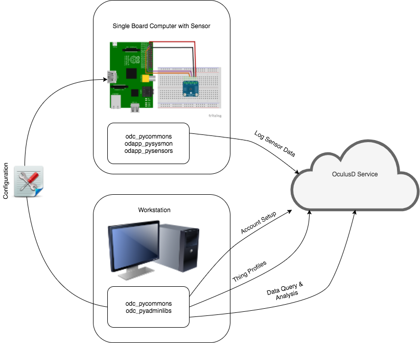

# Introduction

 OculusD.com, Inc. is a company that provide a platform, services and applications aimed at the IoT and IIoT markets. In essence, this means that any "thing" connected to the Internet could use OculusD to log sensor data. At a later stage, the data can be queried, analysed and processed in ways that will help you understand or monitor your environment and perhaps even learn something new!

The overall solution consists of three parts:

* Platform - A cloud based platform where all data is aggregated
* Services - Additional value add services that will be provided by OculusD to query and analyse your data.
* Applications - The software applications (and libraries) you will need to integrate your IoT/IIoT things with OculusD
  
## Where does what fit in

 The cloud platform is where all the RESTFul API end-points are you need to integrate to. It is depicted in the diagram as the "OculusD Service".

Under most circumstances, you will manage your account(s) and things from a Workstation. This is a computer you typically have full access to and can trust as this is where your credentials and profiles will be saved within your environment (don't worry - if you loose anything, it can be re-created from data in the cloud!).

On the workstation, you will typically install several tools:

* odc_pycommons - The common Python libraries used by all Python based applications integrating to OculusD
* odc_pyadminlibs - The Python libraries required to perform administrative tasks

From the Workstation, you will also export specific configurations to be installed and/or used on your "things".

On your "thing" (a Raspberry Pi in this example, with a TMP006 Temperature Sensor), additional libraries and applications will be required to collect and send data to the OculusD Service.

On the thing, you will typically install the following tools (based on the example in the image):

* odc_pycommons - The common Python libraries used by all Python based applications integrating to OculusD
* odapp_pysysmon - Python based system monitoring (CPU, Memory, Storage and various on board sensors
* odapp_pysensors - Python based application that uses the configuration generated from the Workstation, with potentially additional libraries, to collect data from sensors and send the data to OculusD

**NOTE**: The above utilities and libraries still need to be updated to the latest deployed API version. For now we strongly suggest experienced users refer to the [Swagger UI](https://data-us1.oculusd.com/v2/ui/) which we have also [documented here](swagger.md) for integration into your projects.
